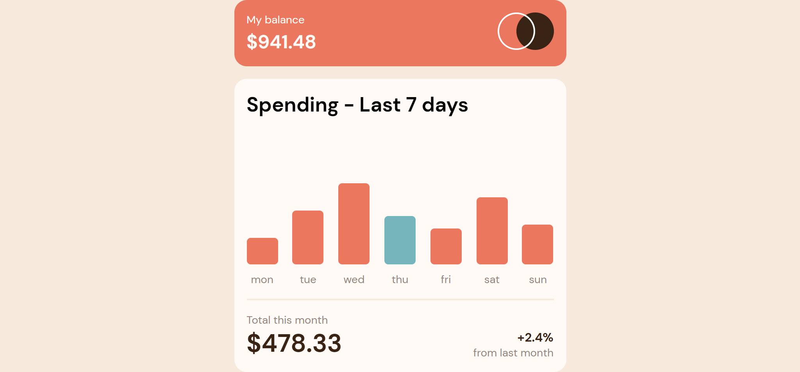

# Expenses-Chart-Component
# 📊 Creating a bar chart component from scratch 

This is a solution to the [Expenses chart component](https://www.frontendmentor.io/challenges/expenses-chart-component-e7yJBUdjwt). In this challenge, you need to create a bar chart component from scratch using vanilla Javascript.

## Overview

### The challenge

Your challenge is to build out this bar chart component and get it looking as close to the design as possible.
You can use any tools you like to help you complete the challenge. So if you've got something you'd like to practice, feel free to give it a go.
We provide the data for the chart in a local data.json file. So you can use that to add the bars dynamically if you choose.

Your users should be able to:

- View the bar chart and hover over the individual bars to see the correct amounts for each day
- See the current day's bar highlighted in a different colour to the other bars
- View the optimal layout for the content depending on their device's screen size
- See hover states for all interactive elements on the page
- Bonus: See dynamically generated bars based on the data provided in the local JSON file

### Screenshot

### Links

- Solution URL: (https://yonathan-palma.github.io/expenses-chart/)

## My process

### Built with

- Semantic HTML5 markup
- CSS custom properties
- Flexbox
- CSS Grid
- Javascript
- fetch
- requestAnimationFrame
- json

### What I learned

It was the first time I worked with local JSON data and the requestAnimationFrame API for animations, which I'm sure will be very useful from now on

### Continued development

A Further exploring the requestAnimationFrame API.

## Author

- Website - [Yonathan Palma](https://github.com/yonathan-palma)
- Frontend Mentor - [@yonathan-palma](https://www.frontendmentor.io/profile/yonathan-palma)